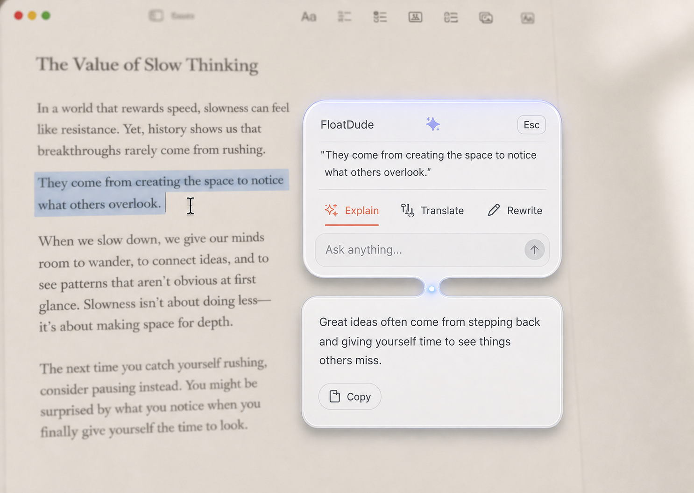
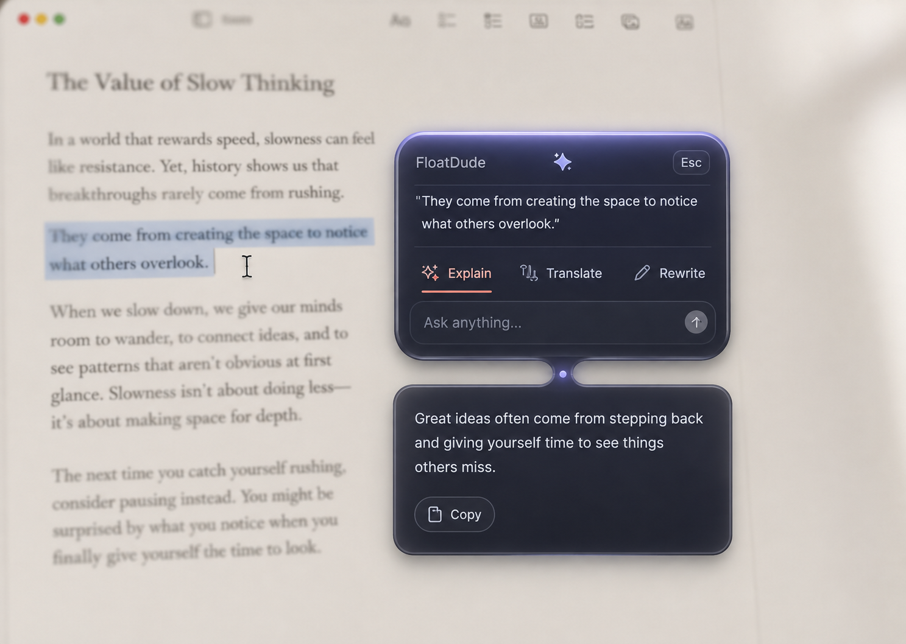

# UI direction — Adaptive Glass

**Status:** accepted for FloatDude v0.1.0
**Decision:** FloatDude uses one adaptive glass visual system with a Light and Dark appearance. It follows the current macOS appearance; dark mode is not the permanent brand expression.

## Visual references

| Light Glass | Dark Glass |
| --- | --- |
|  |  |

These images establish material, hierarchy, and tone—not pixel-perfect copy, icons, or geometry. Use SF Symbols or a future approved brand asset; do not ship generated icons or text from the references.

## Product principle

> **Adaptive Glass, One-Breath Motion.**

FloatDude should feel like a small piece of macOS material briefly rising above the user’s work. It appears near the cursor, handles one request, and leaves. It must never read as a permanent chat client, dashboard, or secondary workspace.

## Appearance contract

| Element | Light Glass | Dark Glass |
| --- | --- | --- |
| Primary material | Frosted pearl-white with subtle blue-gray refraction | Translucent graphite-indigo, never pure black |
| Main text | Warm charcoal | Soft white |
| Secondary text and dividers | Cool gray | Desaturated lavender-gray |
| Active action | Restrained coral, plus label and underline | Same coral, tuned for contrast |
| Edge aura | Low-opacity lavender-blue, visible only against the panel edge | Same hue, slightly brighter but never neon |

- v0.1 follows the system Light/Dark setting. Do not add a manual theme picker until there is a user reason to override macOS.
- Use native vibrancy/material APIs where possible, with an opaque high-contrast fallback for Reduce Transparency.
- Color never carries state alone: the active action also has an underline and stronger text treatment.
- Body text, actions, and errors must meet a minimum 4.5:1 contrast ratio in both appearances.

## Panel structure

The visual references suggest an upper bubble and a response sheet. The implementation must render this as **one `NSPanel`** with a single focus and dismissal lifecycle. The small waist/light point is an optional expansion transition, not a second window.

| State | Target size | Required content |
| --- | --- | --- |
| No context | 400 pt wide; 132–176 pt high | Brand mark, `Ask FloatDude…`, action row |
| Context captured | 400 pt wide; 196–236 pt high | Two-line selected-text preview, actions, ask field |
| Streaming/completed | 400 pt wide; grows to 420 pt high | Existing context/action area, response, Copy |
| Long response | 400 pt wide; 420 pt max | Response becomes internally scrollable; panel never grows further |
| Error | 400 pt wide; 196–260 pt high | Actionable error, retry, and Settings path when relevant |

- Permit a width range of 336–456 pt for small displays and accessibility text sizes.
- Place the panel beside the pointer while keeping it fully on the active display. It must not cover the selected text unless screen edges force it.
- Truncate previews after two lines; preserve the complete captured text for the model request, not for visible UI.
- Settings belong in the menu-bar item or a dedicated Settings scene, never in the task panel.

## Interaction hierarchy

1. Selected text or a direct prompt is the context.
2. `Explain`, `Translate`, and `Rewrite` are equal primary actions.
3. `Ask anything…` is the escape hatch, not a fourth chat surface.
4. On first output token, the same panel grows downward and begins rendering the response.
5. `Copy` copies only final visible response text. `Esc`, click-away, or a repeated shortcut cancels active streaming and dismisses the panel.

## Motion and restraint

- Opening: 180–220 ms scale/fade from the pointer-adjacent anchor.
- Expanding to response: 220–280 ms vertical resize, preserving the panel’s top anchor whenever screen bounds allow.
- Dismissal: 120–160 ms fade/scale; no bounce, particle, or mascot animation.
- Reduce Motion replaces size/scale animation with a short opacity transition.
- Use a single faint connection glow only during expansion. It disappears once the response settles.

## Non-negotiable exclusions

- No persistent two-panel layout.
- No large initial window, sidebar, tabs, history list, avatars, chat bubbles, or dashboard cards.
- No hard-coded dark theme, black glass, thick borders, or decorative gradients.
- No stored selected text or answer history in v0.1.

## Design acceptance

- Switching macOS appearance while the panel is visible updates material, text, controls, and focus indicators without restart.
- Light and Dark states preserve the same layout and action hierarchy.
- With Reduce Transparency or Increase Contrast enabled, controls and body copy remain unambiguous and legible.
- At 200% accessibility text sizing, the panel remains within the active display and response content scrolls rather than clipping.
- The screen recording demo must clearly show: shortcut → selection preview → action → one-panel expansion → Copy/Esc.
